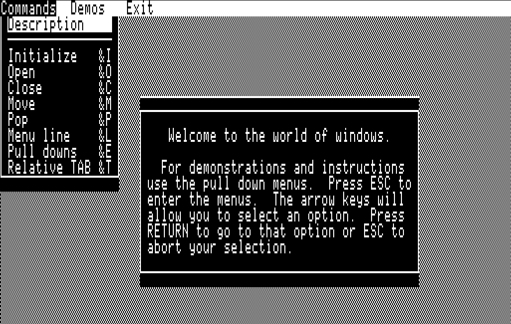

Window Pack
===========
|MIT| |APPLE| |Itch|

.. |MIT| image:: https://img.shields.io/badge/License-MIT-yellow.svg
   :target: https://opensource.org/licenses/MIT

.. |APPLE| image:: https://img.shields.io/badge/Apple%20II-ProDOS-0000C0.svg?logo=apple&logoColor=ee0000
   :target: https://github.com/AppleWin/AppleWin

.. |Itch| image:: https://img.shields.io/badge/Itch.io-fa5c5c.svg
   :target: https://myleftgoat.itch.io/

Overview
--------
This is an old logic simulator written back in 1986 for the Apple II.  It
made it possible to play around with simple networks of basic one and two
input logic gates. Up to 8 inputs are supported and the simulation is run
for 8 clocks.  Note: execution is synchronous, that is gate delay is not
part of the simulation.  Thus, entities such as flip-flops may not run
in deterministic fashion, but they will generally resolve as expected.

In 2024, the original source code to the simulator was unearthed and the original
programmer decided to fix up the project enough so that it could be rebuilt
from source and run.   Originally, the program was written for DOS 3.3
but was converted over to ProDOS recently as can be seen in the github 
history.  The resulting source code is in this repo and one can
download a generated disk image from itch.io.

Details
-------
The program is written in a combination of AppleSoft and Merlin 65C02 assembly.

There is a build script in this repo that is capable of generating a .po file 
from the sources.  It requires several tools to be installed:

- Python
- `Merlin32 Assembler <https://brutaldeluxe.fr/products/crossdevtools/merlin/>`_
- `CiderPress II <https://ciderpress2.com/>`_

If one places the CiderPress CLI in a subdirectory named 'ciderpress' (ciderpress/cp2.exe)
and places the Merlin package in a subdirectory named 'merlin32' 
(merlin32\\Windows\\Merlin32.exe), then the following commands will build
the `Windowpack_Release.po` file:

.. code::

   python -m virtualenv venv
   .\venv\Scripts\activate.ps1
   python build.py

One can adjust the pathnames to CiderPress and Merlin at the top of the build.py file.

Documentation and Issues
------------------------
TBD

Normally, one would download the `.po` file and use it with an emulator or 
burn a 5.25" disk with the image.  Thanks to the great work by Chris Torrence
and Michael Morrison on the `Apple2TS <https://github.com/ct6502/apple2ts>`_ browser 
hosted Apple II emulator, one can run the program via a web browser.  

`Run Window Pack in a browser <https://apple2ts.com/?appmode=game&theme=dark#https://github.com/randall-frank/digisim/releases/download/v1.2.0/DigiSim_Release.po>`_

Please feel free to post issues and other questions at `DigiSim Issues
<https://github.com/randall-frank/windowpack/issues>`_. This is the best place
to post questions and code.

The game is also hosted on `itch.io <https://myleftgoat.itch.io/windowpack>`_ which provides
a simpler download option and forum to discuss more gameplay related issues.

Things To Do
~~~~~~~~~~~~
TBD

License
-------
`WindowPack` sources are licensed under the MIT license.
